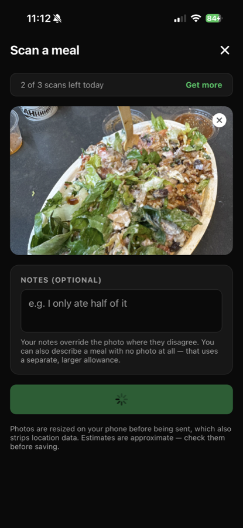
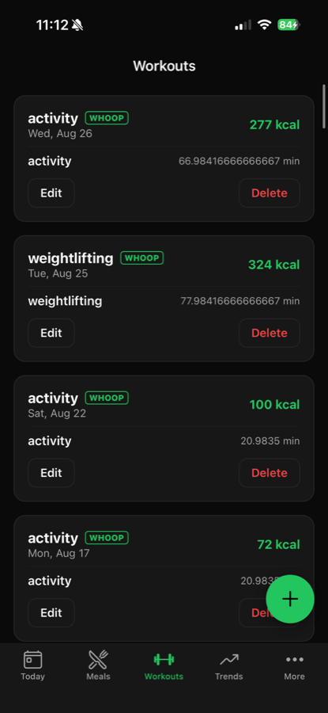
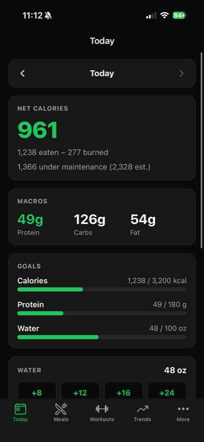
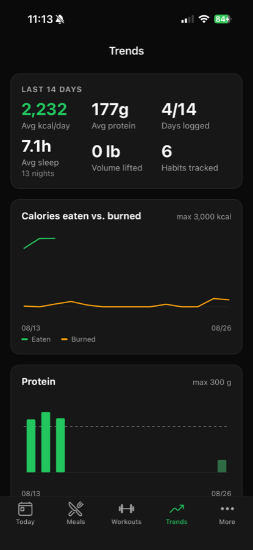
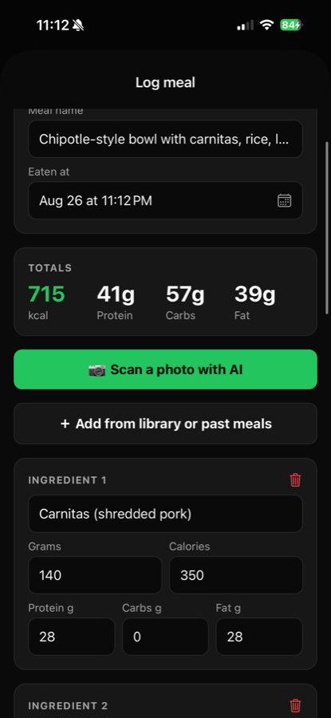

# FitTrackAI for iOS

A native iOS app for tracking meals, workouts, and body metrics — with an AI
photo scanner that reads a plate of food or a nutrition label and fills in the
macros for you.

Built with Expo / React Native and TypeScript, on a Supabase Postgres backend,
with a subscription paywall enforced server-side.

It shares a database and its domain logic with an existing Next.js web app
([fittrack.rosstoma.me](https://fittrack.rosstoma.me)), so the two clients read
and write the same rows.

<p align="center">
  
  
  
  
  
</p>

---

## What it does

| | |
|---|---|
| **Meals** | Per-ingredient logging with a personal food library that auto-saves anything you log, favourites, and one-tap re-logging of a past meal |
| **Photo scanning** | Snap a meal or a nutrition label; Claude returns per-ingredient weights and macros |
| **Workouts** | Per-set strength logging (135×10, 155×8, 175×5 — recorded as-is, not flattened), MET-based calorie burn |
| **Exercise history** | Tap any lift for all-time bests, estimated 1RM, and session-volume charts |
| **Trends** | 14-day charts for calories in vs. out, macros, and training volume |
| **Weekly review** | Monday–Sunday goal grid with a hit-rate percentage |
| **Daily** | Water, habits, supplements |
| **AI coach** | Chat that can see the day's logged totals and answer against them |

---

## Stack

**Client** — Expo SDK 57, React Native 0.86, React 19, TypeScript, expo-router
**Backend** — Supabase (Postgres, Auth, Storage) + 5 Deno Edge Functions
**AI** — Claude Haiku 4.5 and Sonnet 4.6 via the Anthropic API
**Payments** — Apple In-App Purchase via RevenueCat, plus Stripe for web
**Charts** — hand-rolled on `react-native-svg`

---

## Engineering notes

The parts of this that were actually interesting to build.

### The paywall can't be defeated by modifying the client

`entitlements` has a **select-only** RLS policy and no insert, update, or delete
policy at all. The only writers are the RevenueCat and Stripe webhooks, running
as the service role. A patched app can't grant itself Pro, because there is no
code path through which the client can write that table.

Every AI call re-reads the tier and re-counts the day's usage server-side before
spending anything. The counters shown in the UI are cosmetic — a `429` from the
Edge Function is the authoritative answer.

Subscription expiry is enforced **on read as well as on write**, because
webhooks get delayed and dropped, and an `active` row with a past `expires_at`
must not keep working.

### Two payment sources, one entitlement

`entitlements` is keyed on `(user_id, source)`, not `user_id`. With one row per
user, a RevenueCat `EXPIRATION` event for an old App Store subscription would
overwrite the row and revoke a Stripe subscription the user is actively paying
for. Each webhook now touches only its own row, and an `effective_entitlement`
view resolves them to *pro if any source is active*.

### Upload validation assumes the client is hostile

The declared MIME type is **ignored entirely** — anyone can claim `image/jpeg`
and send a shell script — so the real type is sniffed from magic bytes and that
is what's used downstream. On top of that:

- Dimensions are read from the file header and capped, because a 40 KB PNG can
  decode to gigabytes of pixels
- SVG is rejected outright: it's XML, it can carry `<script>`, and there's no
  version of accepting it that's safe
- Storage paths are built from the user id plus a server-generated UUID, so a
  crafted filename can't escape the user's own prefix

15 tests cover this, each one an attack: HTML, SVG, PHP, ELF binaries, ZIPs,
decompression bombs, oversized payloads, truncated headers.

```bash
deno test supabase/functions/_shared/
```

### Photos are stripped of location data before they leave the phone

Meal photos are re-encoded client-side before upload. That bounds the file size
and — the part that matters for a health app — drops all EXIF, including the GPS
coordinates iPhones embed by default. Sending someone's home location attached
to a photo of their lunch is a real leak, so the resize isn't just an
optimisation.

### Model choice is a cost decision, and it's tiered

Meal estimation is structured extraction from an image, which runs on Haiku 4.5
at roughly a third of Sonnet's cost. The coach runs on Sonnet for Pro users and
Haiku for free users — a free account generates no revenue, and one Sonnet coach
message a day would cost more than the rest of that user's free allowance
combined.

Per-day allowances, enforced server-side:

| | Free | Pro |
|---|---|---|
| Photo scans | 3 | 15 |
| Text meal estimates | 3 | 30 |
| Coach messages | 1 | 15 |

Every other feature — logging, workouts, trends, goals, the weekly review — is
free and unlimited. Each tier also carries a hard daily **spend cap**, which is
what actually bounds cost: a call allowance can't, because one long coach
conversation costs many times what a photo scan does.

### Timezone handling has its own runtime self-check

Day bucketing runs through a single module pinned to the user's timezone, never
the server's — a meal logged at 9pm Toronto is 1am UTC the next day, and
bucketing on the raw timestamp files it under tomorrow. That bug shipped three
separate times on the web app.

React Native runs on Hermes, whose `Intl` implementation is separate from
Node's. If it were to ignore the `timeZone` option, the same bug would return
silently. So the app checks at runtime and renders a visible warning rather than
trusting that it works.

### Native modules degrade instead of crashing

`react-native-purchases` isn't bundled into Expo Go, and importing a missing
native module at module scope kills the app on launch. It's required lazily
behind a capability check, so the whole app stays testable in Expo Go and the
paywall reports honestly why purchasing is unavailable.

---

## Architecture

```
src/
  app/                  expo-router — the folder structure is the routing
    (tabs)/             Today · Meals · Workouts · Trends · More
    meal/               new + [id] edit
    workout/            new + [id] edit
    exercise/[name]     per-lift history and PRs
    legal/              privacy policy + terms, bundled for offline reading
  components/           design system, forms, charts, photo scanner
  lib/
    supabase.ts         client — session in device storage, not cookies
    auth.tsx            session context + route guard
    entitlement.tsx     tier + usage, mirrored from the server
    queries.ts          every database read and write, in one place
    api.ts              Edge Function calls
    day.ts              timezone-safe day bucketing        ┐
    strength.ts         volume, 1RM, set formatting         │ shared with
    weekReview.ts       weekly goal evaluation              │ the web app
    exercises.ts        MET-based calorie burn              │
    micros.ts           micronutrient totals                │
    profile.ts          Mifflin-St Jeor BMR                ┘

supabase/
  migrations/           SQL, applied by hand
  functions/
    analyze-photo/      photo/text → nutrition
    coach-chat/         coach reply with the day's totals as context
    delete-account/     App Store guideline 5.1.1(v)
    revenuecat-webhook/ writes the app_store entitlement
    stripe-webhook/     writes the stripe entitlement
```

### Shared domain logic

Six modules under `src/lib/` are byte-identical to the web app's. They're pure
TypeScript with no framework imports, which is why they port unchanged — around
570 lines of tested business logic that didn't need rewriting for a different
platform. Their test suites came with them.

This is duplication and it will drift. Extracting a shared package is the right
fix; it's deferred rather than half-done, because it means restructuring a web
app that's in daily use.

---

## Tests

```bash
npx tsc --noEmit                    # types
npx vitest run                      # 74 domain-logic tests
deno test supabase/functions/_shared/   # 15 upload-security tests
npx expo export --platform ios      # catches runtime import errors
```

---

## Running it

```bash
npm install
cp .env.example .env    # Supabase URL + anon key
npx expo start
```

Environment variables are inlined at bundle time, so restart the dev server
after editing `.env` — a reload isn't enough.

The AI features additionally need the Edge Functions deployed and
`ANTHROPIC_API_KEY` set as a Supabase secret. See
[`supabase/README.md`](supabase/README.md).

### A note on keys

The Supabase anon key ships inside the app bundle. That's by design — it's an
identifier, not a credential, and it's already public in any web build. Row
Level Security is the actual boundary: all 15 tables have it enabled with every
policy scoped to `auth.uid()`, so without a valid session that key returns
nothing.

The keys that matter — service role, Anthropic, Stripe, RevenueCat webhook
secret — are never in the bundle. They live as Supabase Edge Function secrets.

---

## Status

Working and feature-complete for its core loop; not yet on the App Store.

**Done** — auth, all tracking screens, AI photo scanner and coach, subscription
paywall, in-app account deletion, privacy policy and terms.

**Next** — HealthKit integration, push notifications, App Store Connect setup
(subscription product, screenshots, privacy labels), submission.

Not yet ported from the web app: USDA food search and WHOOP sync, both of which
need OAuth secrets that can't live on a phone.
